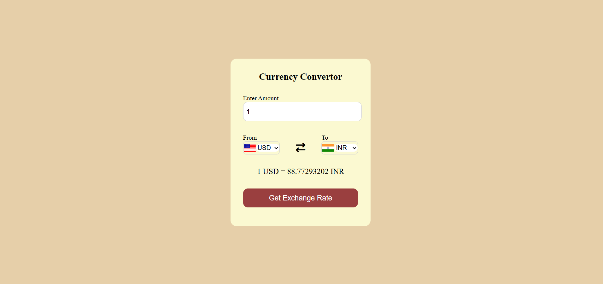

# Currency Converter

A simple and accurate currency conversion tool built for the web.

**[▶️ Try the Converter!](https://palakagrawal006.github.io/currency-converter/)**

---

### Features

* **Real-Time Conversion:** Uses a third-party API to get the latest exchange rates.
* **User-Friendly Interface:** Allows you to easily select currencies and enter amounts.
* **Wide Currency Selection:** Supports a large number of global currencies.

### Technologies Used

* **HTML5:** For the page structure.
* **CSS3:** For styling and layout.
* **JavaScript:** For the core conversion logic and API calls.
* **External API:** Fetches real-time exchange rate data.

---

### How to Use

1.  Enter the amount you wish to convert.
2.  Select the "From" and "To" currencies from the dropdown lists.
3.  Click the "Get Exchange Rate" button to see the converted amount.

---

### Getting Started

To run a local copy of this project, follow these steps:

1.  Clone the repository:
    ```sh
    git clone [https://github.com/palakagrawal006/currency-converter.git](https://github.com/palakagrawal006/currency-converter.git)
    ```
2.  Navigate to the project directory:
    ```sh
    cd currency-converter
    ```
3.  Open the `index.html` file in your web browser.

---

### Screenshot


